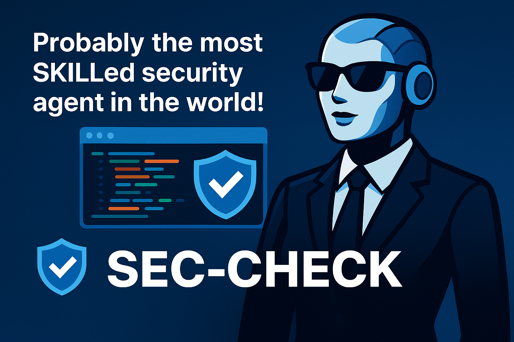
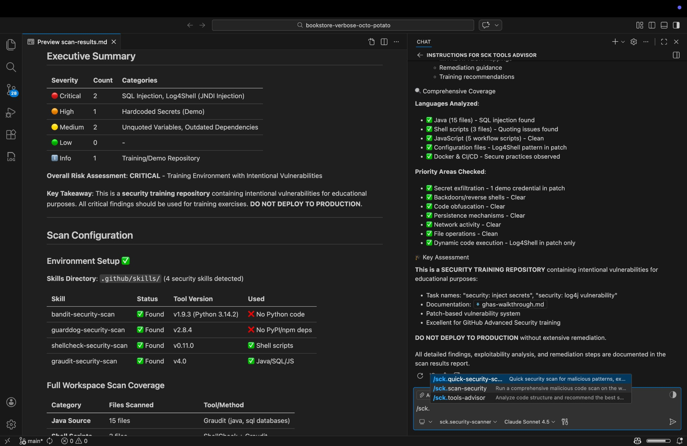
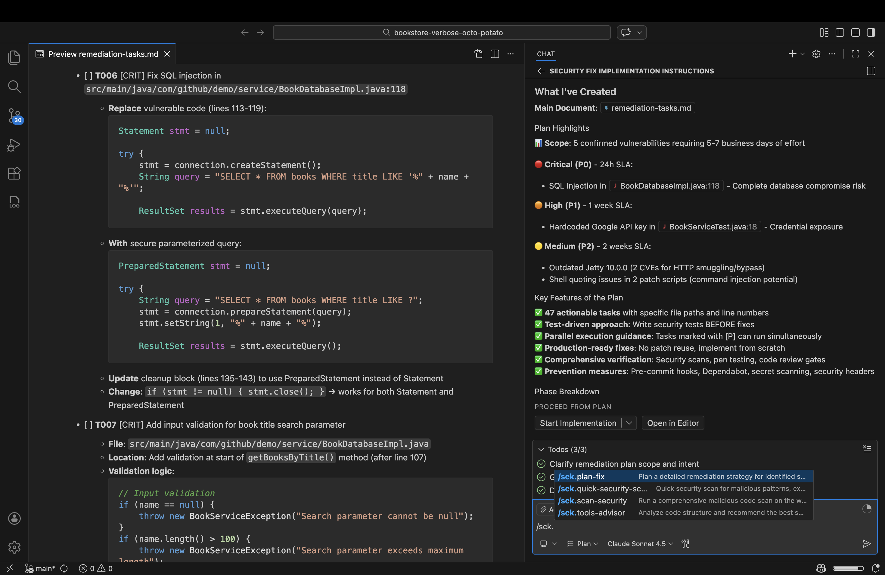

[View results of a full scan here](audit-results/scan-results.md)

---

## Installing from a Release

All release artifacts are attached to each [GitHub Release](https://github.com/alxayo/sec-check/releases). A release contains:

| File | What it is |
|------|-----------|
| `agentsec_core-X.Y.Z-py3-none-any.whl` | Core agent library |
| `agentsec_cli-X.Y.Z-py3-none-any.whl` | CLI entry point (`agentsec` command) |
| `agentsec-X.Y.Z.vsix` | VS Code extension |
| `agentsec-copilot-assets-X.Y.Z.zip/.tar.gz` | Copilot skills, agents & prompts |

---

### Option A — VS Code Extension (interactive)

#### Step 1 — Prerequisites

- VS Code 1.95 or later
- A GitHub Copilot subscription

#### Step 2 — Download the VSIX

Go to the [latest release](https://github.com/alxayo/sec-check/releases/latest) and download `agentsec-X.Y.Z.vsix`.

#### Step 3 — Install the extension

**From the VS Code UI:**
1. Open the **Extensions** sidebar (`Ctrl+Shift+X` / `Cmd+Shift+X`)
2. Click the `...` menu (top-right of the sidebar) → **Install from VSIX…**
3. Select the downloaded `.vsix` file → click **Install**
4. Reload VS Code when prompted

**Or from the terminal:**
```bash
code --install-extension agentsec-0.1.2.vsix
```

#### Step 4 — Run a security scan

- Open the Command Palette (`Ctrl+Shift+P` / `Cmd+Shift+P`)
- Run **AgentSec: Scan Workspace for Security Issues**

Or right-click any folder in the Explorer sidebar → **AgentSec: Scan Folder for Security Issues**.

Results appear in the **AgentSec** panel in the Activity Bar.

---

### Option B — CLI tool (automated / CI)

#### Step 1 — Prerequisites

- Python 3.12+ (3.11 minimum)
- GitHub Copilot subscription
- GitHub Copilot CLI installed and authenticated:
  ```bash
  # Install Copilot CLI (requires GitHub CLI)
  gh extension install github/gh-copilot
  gh auth login
  ```

#### Step 2 — Download the wheel files

Go to the [latest release](https://github.com/alxayo/sec-check/releases/latest) and download both:
- `agentsec_core-X.Y.Z-py3-none-any.whl`
- `agentsec_cli-X.Y.Z-py3-none-any.whl`

#### Step 3 — Create a virtual environment and install

macOS (and modern Linux distros) block installing packages into the system Python to protect system tools. Always install into a virtual environment:

```bash
# Create a venv (once — pick any location you like)
python3 -m venv ~/agentsec-venv

# Activate it (run this every new shell session)
source ~/agentsec-venv/bin/activate

# Install both wheels (core must come first)
pip install agentsec_core-0.1.2-py3-none-any.whl
pip install agentsec_cli-0.1.2-py3-none-any.whl

# Verify
agentsec --version
```

#### Step 4 — Scan a folder

```bash
# Basic scan
agentsec scan ./path/to/code

# Faster parallel scan (runs scanners concurrently)
agentsec scan ./path/to/code --parallel

# Limit parallel concurrency (default 3)
agentsec scan ./path/to/code --parallel --max-concurrent 5

# Verbose output (shows SDK events and tool activity)
agentsec scan ./path/to/code --verbose
```

The agent produces a Markdown report with severity levels, line numbers, code snippets, and remediation advice. By default the report is printed to stdout; redirect it to a file:

```bash
agentsec scan ./path/to/code > security-report.md
```

#### Step 5 (optional) — Custom configuration

Create an `agentsec.yaml` in your project root (see [agentsec.example.yaml](agentsec.example.yaml)):

```yaml
system_message: |
  You are a security expert focusing on Python web apps.
  Prioritise SQL injection and authentication flaws.

initial_prompt: |
  Scan {folder_path} for HIGH and CRITICAL severity issues only.
```

Then pass it to the CLI:
```bash
agentsec scan ./src --config ./agentsec.yaml
```

---

### Option C — Copilot Skills & Prompts (Copilot Toolkit)

#### Step 1 — Download the Copilot assets archive

Go to the [latest release](https://github.com/alxayo/sec-check/releases/latest) and download `agentsec-copilot-assets-X.Y.Z.zip`.

#### Step 2 — Extract into your repository

```bash
cd /path/to/your-repo
unzip agentsec-copilot-assets-0.1.2.zip
# This adds .github/skills/, .github/agents/, .github/prompts/ to your repo
```

#### Step 3 — Use the prompts in Copilot Chat

In VS Code Copilot Chat, type `/` to see available slash commands:

| Slash command | What it does |
|---------------|-------------|
| `/sechek.security-scan` | Full workspace security scan |
| `/sechek.security-scan-quick` | Fast scan for reverse shells, exfiltration, backdoors |
| `/sechek.security-scan-python` | Python scan (Bandit + GuardDog) |
| `/sechek.security-scan-shell` | Shell script scan (ShellCheck + Graudit) |
| `/sechek.security-scan-supply-chain` | Dependency supply-chain scan |
| `/sechek.security-scan-iac` | IaC scan (Terraform, Kubernetes, Dockerfiles) |
| `/sechek.plan-fix` | Generate a prioritised remediation plan from scan results |

Or use the **`@sechek.security-scanner`** agent directly in Copilot Chat for interactive deep analysis.

---

## Building from Source

To build distributable packages (Wheel files) with Semantic Versioning:

1. Run the build script with your desired version:
  ```bash
  python3 scripts/build_release.py 0.2.0
  ```

2. This will:
  - Update version numbers in `pyproject.toml` and `__init__.py` files
  - Build `.whl` packages for `core` and `cli`
  - Place artifacts in `dist/` folder

3. Install the generated package:
  ```bash
  pip install dist/agentsec_cli-0.2.0-py3-none-any.whl
  ```
# Sec-Check



Scan untrusted code for red flags before you run it—exfiltration, reverse shells, backdoors, and supply-chain traps.

Available as a **VS Code Copilot toolkit** (interactive) AND as a **standalone CLI tool** (automated).

## What It Does

Sec-Check provides security scanning capabilities to detect dangerous patterns in code—credential theft, reverse shells, backdoors, and supply chain attacks. Use it to review scripts from the internet or untrusted sources before execution.

> :warning: **Warning**: This tool catches common red flags, not sophisticated attacks. Always use manual review and sandboxing for high-risk code.

---



[View results of a full scan here](audit-results/scan-results.md)

---

## Components

### VS Code Copilot Toolkit

#### Custom Agent

**`@sechek.security-scanner`** — Malicious Code Scanner Agent

Deep security analysis with pattern detection and remediation guidance. Detects:
- Data exfiltration and credential theft
- Reverse shells and backdoors
- Persistence mechanisms (cron, registry)
- Obfuscated payloads (base64, eval)
- System destruction patterns

Can operate standalone or use security scanning tools (Bandit, GuardDog, ShellCheck, Graudit) when available.

---

#### Security Skills

Skills teach Copilot how to use specific security tools:

| Skill | Purpose | Use For |
|-------|---------|---------|
| **bandit-security-scan** | Python AST-based security analysis | Python code vulnerabilities, dangerous functions (eval, exec, pickle), SQL injection |
| **checkov-security-scan** | Infrastructure as Code security analysis | Terraform, CloudFormation, Kubernetes manifests, Dockerfiles, cloud misconfigurations, IAM policies |
| **dependency-check-security-scan** | Software Composition Analysis (SCA) for known CVEs | Java, .NET, JavaScript, Python, Ruby, Go dependencies, NVD/CISA KEV vulnerability detection |
| **eslint-security-scan** | JavaScript/TypeScript security analysis | JS/TS code vulnerabilities, code injection, XSS, command injection, ReDoS, prototype pollution |
| **guarddog-security-scan** | Supply chain & malware detection | Dependencies (`requirements.txt`, `package.json`), typosquatting, malicious packages |
| **shellcheck-security-scan** | Shell script static analysis | Bash/sh scripts, command injection, unquoted variables |
| **graudit-security-scan** | Multi-language pattern matching | Quick scans on unknown codebases, secrets detection, 15+ languages |
| **trivy-security-scan** | Container, IaC, CVE & secret scanning | Container images, filesystem dependencies, Kubernetes clusters, IaC misconfigurations, hardcoded secrets, SBOM generation |

---

#### Custom Prompts

| Prompt | When to Use |
|--------|-------------|
| **`/sechek.tools-advisor`** | Get recommendations on which tools to run based on your codebase |
| **`/sechek.tools-scan`** | Execute security tools and save results to `tools-audit.md` |
| **`/sechek.security-scan`** | Full workspace scan with the security scanner agent |
| **`/sechek.security-scan-quick`** | Fast scan for malicious patterns, exfiltration, reverse shells |
| **`/sechek.security-scan-python`** | Python-focused scan using Bandit and GuardDog |
| **`/sechek.security-scan-iac`** | Infrastructure as Code scan using Checkov for cloud misconfigurations |
| **`/sechek.security-scan-shell`** | Shell script scan using ShellCheck and Graudit |
| **`/sechek.security-scan-supply-chain`** | Scan dependencies for supply chain attacks |
| **`/sechek.security-scan-precommit`** | Pre-commit check for secrets and vulnerabilities |
| **`/sechek.plan-fix`** | Generate a prioritized remediation plan from scan results |
| **`/create-security-skill`** | Create a new security scanning skill from tool documentation |

---

#### Security Remediation Planning

After running security scans, use `/sechek.plan-fix` to generate a detailed remediation plan with prioritized tasks, timelines, and fix patterns.



[View a sample remediation plan here](audit-results/remediation-tasks.md)

The plan includes:
- **Prioritized tasks** grouped by severity (Critical -> High -> Medium -> Low)
- **SLA timelines** (24 hours for Critical, 1 week for High, etc.)
- **Fix patterns** with vulnerable vs. secure code examples
- **Parallel execution opportunities** to speed up remediation
- **Verification commands** to confirm fixes

---

### Standalone CLI Tool (AgentSec)

AgentSec is a standalone CLI tool built with the GitHub Copilot SDK that automates security scanning programmatically.

#### Prerequisites

- Python 3.12+ (3.11 minimum)
- GitHub Copilot subscription
- GitHub Copilot CLI installed and authenticated

#### Quick Start

```bash
# Install packages
pip install -e ./core
pip install -e ./cli

# Scan a folder
agentsec scan ./test-scan

# Scan with parallel mode
agentsec scan ./test-scan --parallel

# See all options
agentsec --help
```

#### What Gets Scanned

AgentSec uses **Copilot CLI built-in tools** (`bash`, `skill`, `view`) to invoke real security scanners and analyze your code. The agent follows a structured workflow:

1. **File Discovery** — Uses `bash` with `find` to discover all files in the target folder
2. **Security Scanning** — Invokes Copilot CLI agentic skills and/or runs scanner CLIs directly:
   - **bandit** for Python AST security analysis
   - **graudit** for multi-language pattern-based auditing
   - **guarddog** for supply chain / malicious package detection
   - **shellcheck** for shell script analysis
   - **trivy** for container & filesystem scanning
   - **eslint** for JavaScript/TypeScript security
   - And more (checkov, dependency-check, template-analyzer)
3. **Manual Inspection** — Uses `view` to read suspicious files for deeper LLM analysis
4. **Report Generation** — Compiles all findings into a structured Markdown report with severity levels, line numbers, code snippets, and remediation advice

#### Parallel Scanning Mode

By default, AgentSec runs all scanners sequentially in a single LLM session. With `--parallel`, it uses a **sub-agent orchestration** pattern that runs multiple scanners concurrently for faster results:

```bash
# Run available scanners in parallel (default: 3 concurrent)
agentsec scan ./my_project --parallel

# Allow up to 5 scanners at once
agentsec scan ./my_project --parallel --max-concurrent 5
```

**How parallel mode works** (3-phase workflow):

1. **Discovery** — Walks the target folder, classifies files by type, determines which scanners are relevant and available, builds a scan plan
2. **Parallel Scan** — Spawns one sub-agent session per relevant scanner. Each session focuses on exactly one scanner tool. Sessions run concurrently via `asyncio.gather` with a semaphore to cap parallelism
3. **Synthesis** — Feeds all sub-agent findings into a synthesis session that deduplicates, normalizes severity, and compiles a single consolidated Markdown report

#### Reliability Features

- **Activity-based stall detection**: Monitors SDK events continuously; nudges are sent after 120s of inactivity; after 3 unresponsive nudges the session is aborted
- **Transient error retry**: Rate limits (429), 5xx, and other transient session errors are automatically retried with exponential backoff
- **Configurable timeout**: Default 1800s safety ceiling; partial results returned on timeout
- **Safety guardrails**: System message prevents execution of scanned code, blocks dangerous commands, and defends against prompt injection
- **Dynamic system message**: Available scanner skills are discovered at runtime and injected into the system message
- **Per-sub-agent isolation** (parallel mode): Each sub-agent runs in its own session; failures in one scanner don't affect others

#### Progress Tracking

AgentSec provides real-time progress feedback during scans:

```
Spinning Starting security scan of ./my_project

  folder Found 15 files to scan

  Spinning [progress bar] 50% Scanning (8/15): app.py
  warning Finished app.py: 2 issues found

check Scan complete: 15 files scanned, 5 issues found (23s)
```

#### Configuration

AgentSec can be configured via:

1. **YAML config file** (`agentsec.yaml`) — Set default system message and initial prompt
2. **CLI arguments** — Override config file settings per-run
3. **External prompt files** — Store long prompts in separate files

See [agentsec.example.yaml](agentsec.example.yaml) for a full example with comments.

**CLI Options:**
| Option | Short | Description |
|--------|-------|-------------|
| `--config FILE` | `-c` | Path to YAML config file |
| `--system-message TEXT` | `-s` | Override system message |
| `--system-message-file FILE` | `-sf` | Load system message from file |
| `--prompt TEXT` | `-p` | Override initial prompt template |
| `--prompt-file FILE` | `-pf` | Load initial prompt from file |
| `--parallel` | | Run scanners concurrently as sub-agents |
| `--max-concurrent N` | | Max parallel scanners (default 3, requires `--parallel`) |
| `--verbose` | `-v` | Enable debug logging |
| `--timeout SECONDS` | | Safety ceiling timeout (default 1800) |
| `--model MODEL` | `-m` | Override LLM model (default gpt-5) |

---

## Quick Start

### Option A: VS Code Copilot Toolkit

```
/sechek.security-scan
```
Runs comprehensive analysis using available tools and pattern detection.

**Targeted Scans:**
```
/sechek.security-scan-python       # Python code
/sechek.security-scan-shell        # Shell scripts
/sechek.security-scan-supply-chain # Dependencies
```

**Tool Workflow:**
```
/sechek.tools-advisor              # Get tool recommendations
/sechek.tools-scan ./src           # Run recommended tools
@sechek.security-scanner           # Deep analysis with tool output
```

### Option B: Standalone CLI

```bash
# Create and activate a virtual environment
python3 -m venv ~/agentsec-venv
source ~/agentsec-venv/bin/activate

# Install (from release wheels)
pip install agentsec_core-0.1.2-py3-none-any.whl
pip install agentsec_cli-0.1.2-py3-none-any.whl

# Or install from source (editable)
pip install -e ./core
pip install -e ./cli

# Scan
agentsec scan ./test-scan

# Parallel mode
agentsec scan ./test-scan --parallel
```

For detailed setup instructions, see [SETUP.md](SETUP.md).

---

## Output

| File | Generated By | Contents |
|------|--------------|----------|
| `.github/.audit/tools-audit.md` | `/sechek.tools-scan` | Raw tool output |
| `.github/.audit/scan-results.md` | `@sechek.security-scanner` | Analysis with findings & remediation |

---

## Repository Structure

```
.github/
+-- copilot-instructions.md          # AI coding guide (comprehensive)
+-- agents/
|   +-- sechek.malicious-code-scanner.agent.md  # Security scanner agent
|   +-- implementation.agent.md                 # Dev task agent
|   +-- orchestrator.agent.md                   # Dev orchestrator agent
|   +-- context/                                # SDK reference docs
+-- skills/
|   +-- copilot-sdk/                            # SDK development skill
|   +-- bandit-security-scan/                   # Python security
|   +-- checkov-security-scan/                  # IaC security
|   +-- dependency-check-security-scan/         # SCA / CVE detection
|   +-- eslint-security-scan/                   # JavaScript/TypeScript
|   +-- guarddog-security-scan/                 # Supply chain
|   +-- shellcheck-security-scan/               # Shell scripts
|   +-- graudit-security-scan/                  # Multi-language
|   +-- trivy-security-scan/                    # Container & cloud-native
+-- prompts/                                    # Custom prompts
+-- .context/                                   # Attack patterns reference
core/                                           # SDK agent library (Python)
+-- agentsec/
|   +-- agent.py, config.py, orchestrator.py
|   +-- session_runner.py, session_logger.py
|   +-- skill_discovery.py, tool_health.py
|   +-- progress.py, skills.py
+-- tests/
cli/                                            # CLI wrapper (Python)
+-- agentsec_cli/main.py
spec/                                           # Architecture docs
research/                                       # Security research notes
audit-results/                                  # Example scan reports
test-scan/                                      # Test data
```

---

## Setup & Development

See [SETUP.md](SETUP.md) for detailed setup instructions, including virtual environment creation, package installation, and development workflow.

For the architecture guide and SDK patterns, see [.github/copilot-instructions.md](.github/copilot-instructions.md).

---

## Troubleshooting

### `error: externally-managed-environment` when running `pip install`

Python 3.12+ on macOS (and Homebrew-managed Python) blocks `pip install` outside a virtual environment to protect system tools ([PEP 668](https://peps.python.org/pep-0668/)). **Never use `--break-system-packages`** — it risks breaking Homebrew.

**Fix:** Always install into a virtual environment:

```bash
python3 -m venv ~/agentsec-venv
source ~/agentsec-venv/bin/activate
pip install agentsec_core-0.1.2-py3-none-any.whl
pip install agentsec_cli-0.1.2-py3-none-any.whl
```

---

### VS Code extension error: `Tool discovery failed: Python at "python3" cannot import agentsec`

The extension spawns `python3` from your `PATH` (the system Python) to import `agentsec`. If you installed `agentsec-core` into a virtual environment, the system `python3` doesn't know about it.

**Fix:** Tell the extension which Python to use by pointing it at the venv's interpreter.

**Step 1 — Verify the venv Python can import agentsec:**
```bash
~/agentsec-venv/bin/python -c "import agentsec; print(agentsec.__file__)"
```
You should see a file path printed. If you get a `ModuleNotFoundError`, re-run the install step above.

**Step 2 — Set `agentsec.pythonPath` in VS Code:**

Open **Settings** (`Cmd+,`), search for `agentsec.pythonPath`, and set it to the full path of the venv Python:
```
/Users/<your-username>/agentsec-venv/bin/python
```

Or add it directly to `settings.json`:
```json
"agentsec.pythonPath": "/Users/<your-username>/agentsec-venv/bin/python"
```

Reload VS Code after saving the setting.

---

### CLI `agentsec` command not found after install

The `agentsec` command is only available while the virtual environment is **activated**. Either activate it first:
```bash
source ~/agentsec-venv/bin/activate
agentsec --version
```
Or use the full path:
```bash
~/agentsec-venv/bin/agentsec --version
```

---

## Limitations

- Pattern-based detection only—may miss obfuscated or novel attacks
- No guarantee of safety—use as first-pass filter, not final decision
- Requires manual review for context-dependent vulnerabilities

For production or high-security environments, combine with professional security audits and isolated testing.

## License

Coming soon.
